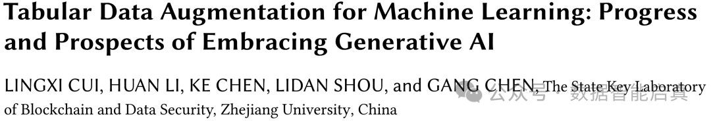

<!--more-->

Machine learning on tabular data is widely applied across various fields such as finance, healthcare, and education. However, obtaining large volumes of high-quality tabular data remains a significant challenge. The process of collecting tabular data is resource-intensive and time-consuming, while privacy concerns further limit data availability. Consequently, many studies have focused on **Tabular Data Augmentation (TDA)** to enhance model training by generating additional data.

This latest review from the Zhejiang University Data Intelligence Team, titled **"Progress and Prospects of Tabular Data Augmentation in the Era of Generative AI"**, provides a comprehensive overview of advancements in TDA. The paper reviews 70 significant studies conducted between 2010 and 2024, summarizing the TDA pipeline and its latest developments. Notably, the integration of generative AI technologies in 2023 and 2024 has opened up new opportunities for TDA.

The article introduces an end-to-end TDA pipeline consisting of three stages: **pre-augmentation**, **augmentation**, and **post-augmentation**, and systematically analyzes retrieval-based and generation-based augmentation techniques. Finally, the paper highlights the current trends and future directions for TDA. The team will continue to update related resources on the SuDIS-ZJU GitHub page.

WeChat public account link:  
[https://mp.weixin.qq.com/s/m7KGuVpjcRBMYfGC0q8AMw](https://mp.weixin.qq.com/s/m7KGuVpjcRBMYfGC0q8AMw)

Paper link:  
[https://arxiv.org/abs/2407.21523](https://arxiv.org/abs/2407.21523)

GitHub repository:  
[https://github.com/SuDIS-ZJU/awesome-tabular-data-augmentation](https://github.com/SuDIS-ZJU/awesome-tabular-data-augmentation)
